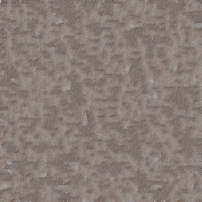
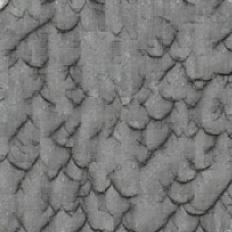
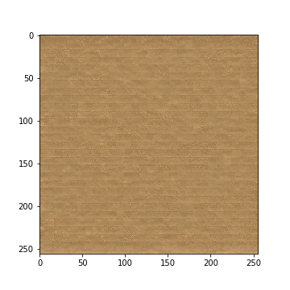

# Texture Optimization implementation & experiments

# 2019/07/30 Result

前回同様, textures.com の素材を使うことにした.

効率化のため実験記録も Python で生成することにした. 次回以降、実行時間も(printで書き出すだけではなくて)変数として記録するようにしたい.

結果としては, いずれにしてもブロックサイズがおそらく小さすぎるように見える. 高速化とともに, もう少し大きいサイズで試してみる必要がありそう.

ブロックサイズに応じて k-means tree の構築時間がそこそこボトルネックになっている.
[近似最近傍探索の最前線](https://speakerdeck.com/matsui_528/jin-si-zui-jin-bang-tan-suo-falsezui-qian-xian) を参考に, 時空間計算量とアルゴリズムについていくらか考察したい.

収束判定についてもやや面倒がある. Z_p の diff に関して振動することが多々あるが, 振動がいつどこで発生するかはかなり謎. 各ループを t < 1s  程度に高速化できたとして, itr=100 くらいまでで打ち切るほうが精神衛生上はよさそう……？

| input | output | optimization |
|:-----:|:------:|:------------:|
|  |   |  | 
| 0001.jpg  size:(256,256) | size:(256,256)   block:(5,5) | | 
|  |   |  | 
| 0002.jpg  size:(256,256) | size:(256,256)   block:(5,5) | | 
|  |   |  | 
| 0003.jpg  size:(256,256) | size:(256,256)   block:(5,5) | | 
|  |   |  | 
| 0004.jpg  size:(256,256) | size:(256,256)   block:(5,5) | | 
|  |   |  | 
| 0005.jpg  size:(256,256) | size:(256,256)   block:(5,5) | | 
|  |   |  | 
| 0006.jpg  size:(256,256) | size:(256,256)   block:(5,5) | | 
|  |   |  | 
| 0001.jpg  size:(256,256) | size:(256,256)   block:(9,9) | | 
|  |   |  | 
| 0002.jpg  size:(256,256) | size:(256,256)   block:(9,9) | | 
|  |   |  | 
| 0003.jpg  size:(256,256) | size:(256,256)   block:(9,9) | | 
|  |   |  | 
| 0004.jpg  size:(256,256) | size:(256,256)   block:(9,9) | | 
|  |   |  | 
| 0005.jpg  size:(256,256) | size:(256,256)   block:(9,9) | | 
|  |   |  | 
| 0006.jpg  size:(256,256) | size:(256,256)   block:(9,9) | | 
|  |   |  | 
| 0001.jpg  size:(256,256) | size:(256,256)   block:(17,17) | | 
|  |   |  | 
| 0002.jpg  size:(256,256) | size:(256,256)   block:(17,17) | | 
|  |   |  | 
| 0003.jpg  size:(256,256) | size:(256,256)   block:(17,17) | | 
|  |   |  | 
| 0004.jpg  size:(256,256) | size:(256,256)   block:(17,17) | | 
|  |   |  | 
| 0005.jpg  size:(256,256) | size:(256,256)   block:(17,17) | | 
|  |   |  | 
| 0006.jpg  size:(256,256) | size:(256,256)   block:(17,17) | | 
|  |   |  | 
| 0001.jpg  size:(256,256) | size:(256,256)   block:(33,33) | | 
|  |   |  | 
| 0002.jpg  size:(256,256) | size:(256,256)   block:(33,33) | | 
|  |   |  | 
| 0003.jpg  size:(256,256) | size:(256,256)   block:(33,33) | | 
|  |   |  | 
| 0004.jpg  size:(256,256) | size:(256,256)   block:(33,33) | | 
|  |   |  | 
| 0005.jpg  size:(256,256) | size:(256,256)   block:(33,33) | | 
|  |   |  | 
| 0006.jpg  size:(256,256) | size:(256,256)   block:(33,33) | | 
